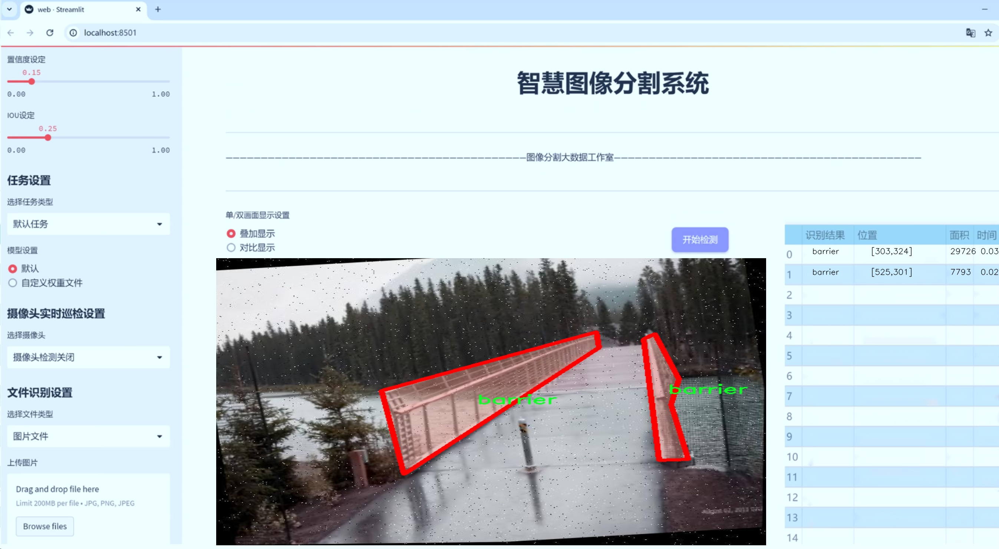
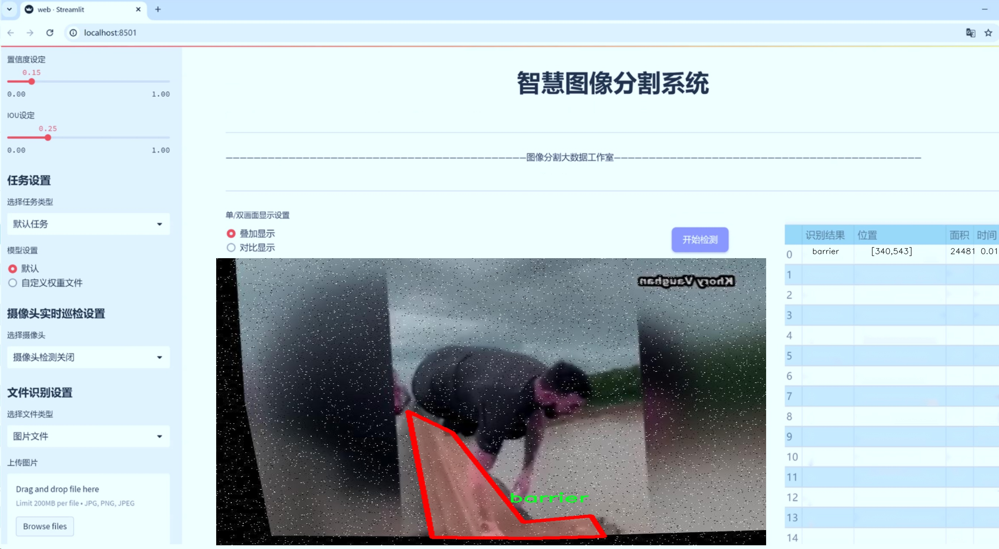
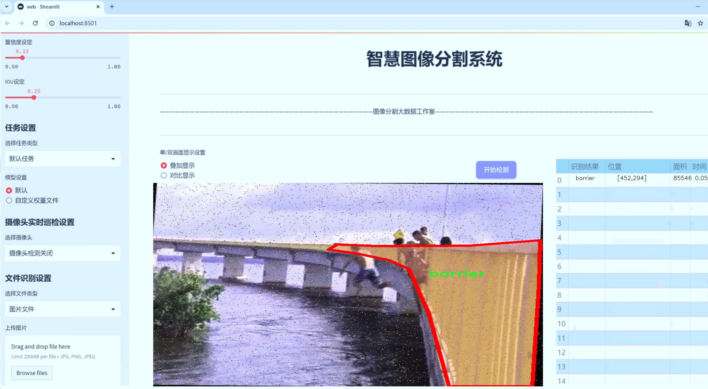
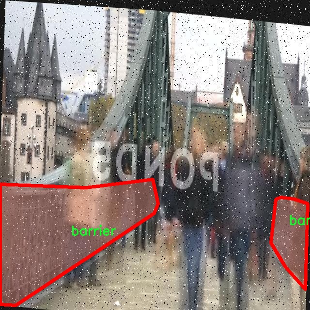
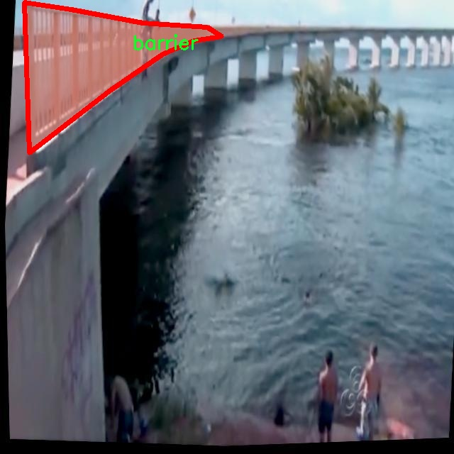
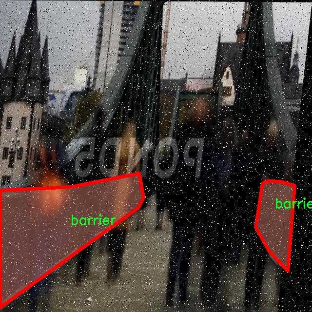
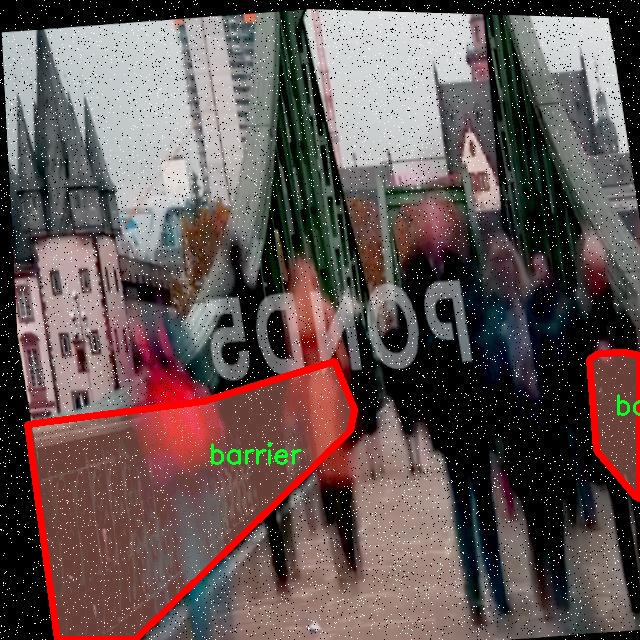
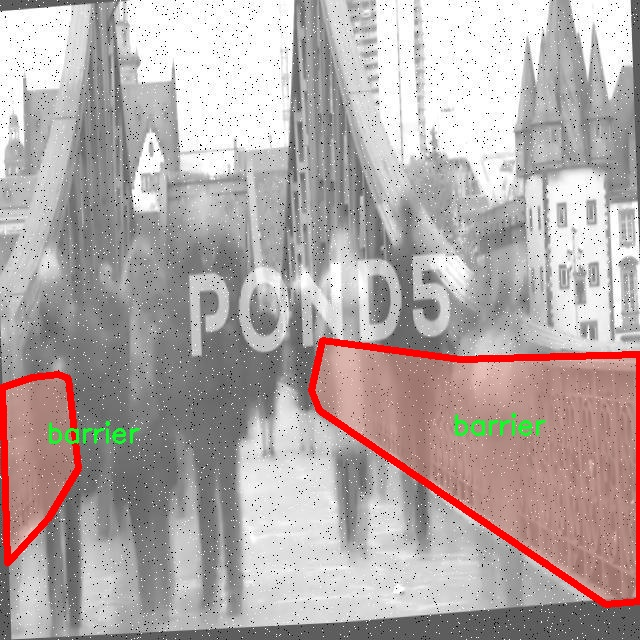

# 桥梁安全监测分割系统： yolov8-seg-RevCol

### 1.研究背景与意义

[参考博客](https://gitee.com/YOLOv8_YOLOv11_Segmentation_Studio/projects)

[博客来源](https://kdocs.cn/l/cszuIiCKVNis)

研究背景与意义

随着城市化进程的加快，桥梁作为重要的交通基础设施，其安全性和稳定性日益受到关注。桥梁不仅承载着日常交通流量，还在突发事件和自然灾害中发挥着至关重要的作用。因此，建立有效的桥梁安全监测系统显得尤为重要。传统的桥梁安全监测方法往往依赖人工检查和定期维护，存在效率低、成本高、反应慢等问题，难以满足现代社会对桥梁安全的高要求。近年来，计算机视觉和深度学习技术的迅猛发展为桥梁安全监测提供了新的解决方案，尤其是目标检测和实例分割技术的应用，使得自动化监测成为可能。

在众多深度学习模型中，YOLO（You Only Look Once）系列因其高效的实时检测能力而备受青睐。YOLOv8作为该系列的最新版本，结合了更为先进的网络结构和优化算法，能够在保证检测精度的同时显著提高处理速度。然而，针对桥梁安全监测的特定需求，YOLOv8的标准模型仍需进行改进，以更好地适应复杂的桥梁环境和多样的监测对象。因此，基于改进YOLOv8的桥梁安全监测分割系统的研究具有重要的理论价值和实际意义。

本研究将使用一个包含2300张图像的数据集，该数据集专注于桥梁安全监测中的两个主要类别：障碍物（barrier）和行人（person）。通过对这些类别的实例分割，系统能够精确识别和定位桥梁周围的潜在安全隐患，如障碍物的存在及其对交通流的影响，以及行人在桥梁附近的活动情况。这种精细化的监测方式不仅可以提高桥梁的安全性，还能为交通管理提供重要的数据支持，帮助决策者及时采取措施，防止事故的发生。

此外，改进YOLOv8的桥梁安全监测分割系统的研究还有助于推动计算机视觉技术在交通安全领域的应用。通过将实例分割与实时监测相结合，可以实现对桥梁及其周边环境的全面监控，提升城市交通管理的智能化水平。随着智能交通系统的不断发展，基于深度学习的监测技术将成为未来交通安全管理的重要组成部分。

综上所述，基于改进YOLOv8的桥梁安全监测分割系统的研究，不仅为桥梁安全监测提供了一种新的技术手段，也为推动智能交通系统的发展奠定了基础。通过对数据集的深入分析和模型的优化，期望能够实现更高效、更准确的桥梁安全监测，为保障公共安全和提升交通管理水平贡献力量。

### 2.图片演示







注意：本项目提供完整的训练源码数据集和训练教程,由于此博客编辑较早,暂不提供权重文件（best.pt）,需要按照6.训练教程进行训练后实现上图效果。

### 3.视频演示

[3.1 视频演示](https://www.bilibili.com/video/BV1dQz2YwEfr/)

### 4.数据集信息

##### 4.1 数据集类别数＆类别名

nc: 1
names: ['barrier']


##### 4.2 数据集信息简介

数据集信息展示

在进行桥梁安全监测分割系统的研究与开发过程中，数据集的选择至关重要。本项目所采用的数据集名为“seguranca em pontes- barreiras e pessoas”，该数据集专门针对桥梁安全监测中的障碍物识别和分割任务进行了精心设计。数据集的构建旨在为改进YOLOv8-seg模型提供高质量的训练数据，从而提升模型在实际应用中的性能和准确性。

“seguranca em pontes- barreiras e pessoas”数据集的核心特点在于其单一类别的设置，类别数量为1，具体类别为“barrier”。这一设计反映了桥梁安全监测中对障碍物的关注，尤其是在桥梁通行安全方面，障碍物的存在可能对车辆和行人造成潜在威胁。因此，数据集中的“barrier”类别涵盖了各种形式的障碍物，如交通锥、围栏、施工标志等，这些都是在桥梁及其周边环境中常见的障碍物。

数据集的构建过程涉及大量的图像采集和标注工作，确保每一张图像都能准确反映出桥梁环境中的障碍物特征。图像来源于不同的桥梁场景，包括城市桥梁、乡村桥梁以及临时施工桥梁等多种环境，确保数据集的多样性和代表性。每张图像都经过精细的标注，障碍物的轮廓被清晰地划定，以便于后续的模型训练和评估。

在数据集的使用过程中，研究人员将利用YOLOv8-seg模型进行训练，该模型以其优越的实时目标检测和分割能力而著称。通过对“seguranca em pontes- barreiras e pessoas”数据集的训练，模型将能够学习到障碍物的特征和位置，从而在实际应用中实现对桥梁安全状况的有效监测。这种监测不仅可以提高桥梁的通行安全性，还能为桥梁的维护和管理提供数据支持，帮助相关部门及时发现和处理潜在的安全隐患。

此外，数据集的设计还考虑到了不同光照条件和天气状况对障碍物识别的影响。数据集中包含了在不同时间段和气候条件下拍摄的图像，确保模型在各种环境下都能保持良好的性能。这种多样性不仅提高了模型的鲁棒性，也为实际应用提供了更为广泛的适应性。

总之，“seguranca em pontes- barreiras e pessoas”数据集为桥梁安全监测分割系统的研究提供了坚实的基础。通过对该数据集的深入分析和应用，研究人员能够不断优化YOLOv8-seg模型，从而提升桥梁安全监测的智能化水平。随着技术的不断进步，未来的桥梁安全监测将更加依赖于数据驱动的方法，而高质量的数据集无疑是实现这一目标的关键。











### 5.项目依赖环境部署教程（零基础手把手教学）

[5.1 环境部署教程链接（零基础手把手教学）](https://www.bilibili.com/video/BV1jG4Ve4E9t/?vd_source=bc9aec86d164b67a7004b996143742dc)


[5.2 安装Python虚拟环境创建和依赖库安装视频教程链接（零基础手把手教学）](https://www.bilibili.com/video/BV1nA4VeYEze/?vd_source=bc9aec86d164b67a7004b996143742dc)

### 6.手把手YOLOV8-seg训练视频教程（零基础手把手教学）

[6.1 手把手YOLOV8-seg训练视频教程（零基础小白有手就能学会）](https://www.bilibili.com/video/BV1cA4VeYETe/?vd_source=bc9aec86d164b67a7004b996143742dc)


按照上面的训练视频教程链接加载项目提供的数据集，运行train.py即可开始训练



     Epoch   gpu_mem       box       obj       cls    labels  img_size
     1/200     0G   0.01576   0.01955  0.007536        22      1280: 100%|██████████| 849/849 [14:42<00:00,  1.04s/it]
               Class     Images     Labels          P          R     mAP@.5 mAP@.5:.95: 100%|██████████| 213/213 [01:14<00:00,  2.87it/s]
                 all       3395      17314      0.994      0.957      0.0957      0.0843

     Epoch   gpu_mem       box       obj       cls    labels  img_size
     2/200     0G   0.01578   0.01923  0.007006        22      1280: 100%|██████████| 849/849 [14:44<00:00,  1.04s/it]
               Class     Images     Labels          P          R     mAP@.5 mAP@.5:.95: 100%|██████████| 213/213 [01:12<00:00,  2.95it/s]
                 all       3395      17314      0.996      0.956      0.0957      0.0845

     Epoch   gpu_mem       box       obj       cls    labels  img_size
     3/200     0G   0.01561    0.0191  0.006895        27      1280: 100%|██████████| 849/849 [10:56<00:00,  1.29it/s]
               Class     Images     Labels          P          R     mAP@.5 mAP@.5:.95: 100%|███████   | 187/213 [00:52<00:00,  4.04it/s]
                 all       3395      17314      0.996      0.957      0.0957      0.0845


### 7.50+种全套YOLOV8-seg创新点加载调参实验视频教程（一键加载写好的改进模型的配置文件）

[7.1 50+种全套YOLOV8-seg创新点加载调参实验视频教程（一键加载写好的改进模型的配置文件）](https://www.bilibili.com/video/BV1Hw4VePEXv/?vd_source=bc9aec86d164b67a7004b996143742dc)

### YOLOV8-seg算法简介

原始YOLOV8-seg算法原理

YOLOv8-seg算法是2023年由Ultralytics推出的一款先进的目标检测与分割模型，它在YOLO系列的基础上，结合了前几代模型的优点，特别是在头部标签分配和损失函数设计方面，借鉴了PP-YOLOE的成功经验。这一新版本的推出，不仅提升了检测精度和速度，还在模型的可训练性和硬件兼容性方面做出了显著改进，成为当前目标检测领域中的佼佼者。

YOLOv8-seg的结构由四个主要部分组成：输入模块、Backbone骨干网络、Neck特征融合网络和Head检测模块。输入模块负责对输入图像进行预处理，包括图像缩放、增强和数据增强等操作，以提高模型的鲁棒性和泛化能力。该模块采用了Mosaic增强技术，能够有效增加训练样本的多样性，从而提升模型在实际应用中的表现。

在Backbone部分，YOLOv8-seg采用了DarkNet结构的改进版本，特别是用C2f模块替代了传统的C3模块。这一改动使得网络在特征提取过程中能够获得更丰富的梯度流动信息，同时保持了轻量级特性，确保了模型在高效运行的同时不牺牲性能。Backbone的设计旨在提取图像中的多层次特征，能够有效捕捉到目标的细节信息和上下文信息。

Neck部分则采用了“双塔结构”，结合了特征金字塔网络（FPN）和路径聚合网络（PAN）。这种设计不仅促进了语义特征和定位特征的有效转移，还增强了特征融合的能力，使得模型能够在不同尺度上更好地检测目标。通过对不同层次特征的有效融合，YOLOv8-seg能够更好地应对复杂场景中的目标检测任务，尤其是在目标大小和形状各异的情况下，表现出色。

Head模块是YOLOv8-seg的核心部分，采用了解耦头的结构，将回归分支和分类分支分离。这一设计的优势在于加速了模型的收敛速度，并提高了检测精度。具体而言，Head模块通过三个独立的检测器，对提取到的特征进行处理，输出目标的位置信息和类别信息。这样的解耦设计使得模型在处理复杂场景时，能够更灵活地调整不同任务的权重，从而提升整体性能。

YOLOv8-seg在训练过程中，采用了改进的损失函数，结合了多种损失计算策略，以更好地优化模型的学习过程。通过引入新的损失项，YOLOv8-seg能够在训练过程中有效平衡定位精度和分类精度，从而在实际应用中实现更高的准确率。

值得一提的是，YOLOv8-seg不仅在目标检测上表现优异，还具备强大的分割能力。通过对特征图的进一步处理，YOLOv8-seg能够实现对目标的精确分割，为后续的应用提供了更为丰富的信息。这一特性使得YOLOv8-seg在农业、自动驾驶、安防监控等多个领域展现出广泛的应用潜力。

在实际应用中，YOLOv8-seg的高效性和准确性使其成为自动化采摘等任务的理想选择。例如，在苹果采摘的场景中，YOLOv8-seg能够快速识别和定位苹果，极大地提高了采摘机器人的工作效率。同时，结合蚁群算法进行路径规划，进一步优化了采摘机器人的作业流程，使得整个采摘过程更加智能化和高效。

综上所述，YOLOv8-seg算法凭借其创新的网络结构和优化的训练策略，成功地将目标检测与分割技术提升到了一个新的高度。它不仅在理论上推动了计算机视觉领域的发展，更在实际应用中展现了强大的实用价值。随着YOLOv8-seg的不断发展和完善，未来在更多领域的应用将会不断涌现，为各行各业带来新的机遇与挑战。


### 9.系统功能展示（检测对象为举例，实际内容以本项目数据集为准）

图9.1.系统支持检测结果表格显示

  图9.2.系统支持置信度和IOU阈值手动调节

  图9.3.系统支持自定义加载权重文件best.pt(需要你通过步骤5中训练获得)

  图9.4.系统支持摄像头实时识别

  图9.5.系统支持图片识别

  图9.6.系统支持视频识别

  图9.7.系统支持识别结果文件自动保存

  图9.8.系统支持Excel导出检测结果数据


### 10.50+种全套YOLOV8-seg创新点原理讲解（非科班也可以轻松写刊发刊，V11版本正在科研待更新）

#### 10.1 由于篇幅限制，每个创新点的具体原理讲解就不一一展开，具体见下列网址中的创新点对应子项目的技术原理博客网址【Blog】：


[10.1 50+种全套YOLOV8-seg创新点原理讲解链接](https://gitee.com/qunmasj/good)

#### 10.2 部分改进模块原理讲解(完整的改进原理见上图和技术博客链接)【如果此小节的图加载失败可以通过CSDN或者Github搜索该博客的标题访问原始博客，原始博客图片显示正常】
### CBAM空间注意力机制
近年来，随着深度学习研究方向的火热，注意力机制也被广泛地应用在图像识别、语音识别和自然语言处理等领域，注意力机制在深度学习任务中发挥着举足轻重的作用。注意力机制借鉴于人类的视觉系统，例如，人眼在看到一幅画面时，会倾向于关注画面中的重要信息，而忽略其他可见的信息。深度学习中的注意力机制和人类视觉的注意力机制相似，通过扫描全局数据，从大量数据中选择出需要重点关注的、对当前任务更为重要的信息，然后对这部分信息分配更多的注意力资源，从这些信息中获取更多所需要的细节信息，而抑制其他无用的信息。而在深度学习中，则具体表现为给感兴趣的区域更高的权重，经过网络的学习和调整，得到最优的权重分配，形成网络模型的注意力，使网络拥有更强的学习能力，加快网络的收敛速度。
注意力机制通常可分为软注意力机制和硬注意力机制[4-5]。软注意力机制在选择信息时，不是从输入的信息中只选择1个，而会用到所有输入信息，只是各个信息对应的权重分配不同，然后输入网络模型进行计算;硬注意力机制则是从输入的信息中随机选取一个或者选择概率最高的信息，但是这一步骤通常是不可微的，导致硬注意力机制更难训练。因此，软注意力机制应用更为广泛，按照原理可将软注意力机制划分为:通道注意力机制（channel attention)、空间注意力机制(spatial attention）和混合域注意力机制(mixed attention)。
通道注意力机制的本质建立各个特征通道之间的重要程度，对感兴趣的通道进行重点关注，弱化不感兴趣的通道的作用;空间注意力的本质则是建模了整个空间信息的重要程度，然后对空间内感兴趣的区域进行重点关注，弱化其余非感兴趣区域的作用;混合注意力同时运用了通道注意力和空间注意力，两部分先后进行或并行，形成对通道特征和空间特征同时关注的注意力模型。

卷积层注意力模块(Convolutional Block Attention Module，CBAM）是比较常用的混合注意力模块，其先后集中了通道注意力模块和空间注意力模块，网络中加入该模块能有效提高网络性能，减少网络模型的计算量，模块结构如图所示。输入特征图首先经过分支的通道注意力模块，然后和主干的原特征图融合，得到具有通道注意力的特征图，接着经过分支的空间注意力模块，在和主干的特征图融合后，得到同时具有通道特征注意力和空间特征注意力的特征图。CBAM模块不改变输入特征图的大小，因此该模块是一个“即插即用”的模块，可以插入网络的任何位置。

通道注意力模块的结构示意图如图所示，通道注意力模块分支并行地对输入的特征图进行最大池化操作和平均池化操作，然后利用多层感知机对结果进行变换，得到应用于两个通道的变换结果，最后经过sigmoid激活函数将变换结果融合，得到具有通道注意力的通道特征图。

空间注意力模块示意图如图所示，将通道注意力模块输出的特征图作为该模块的输入特征图，首先对输入特征图进行基于通道的最大池化操作和平均池化操作，将两部分得到的结果拼接起来，然后通过卷积得到降为Ⅰ通道的特征图，最后通过sigmoid激活函数生成具有空间注意力的特征图。


### 11.项目核心源码讲解（再也不用担心看不懂代码逻辑）

#### 11.1 ultralytics\nn\extra_modules\RFAConv.py

以下是对给定代码的核心部分进行分析和详细注释的结果：

```python
import torch
import torch.nn as nn
from einops import rearrange

# 定义自定义激活函数 h_sigmoid
class h_sigmoid(nn.Module):
    def __init__(self, inplace=True):
        super(h_sigmoid, self).__init__()
        self.relu = nn.ReLU6(inplace=inplace)  # 使用 ReLU6 激活函数

    def forward(self, x):
        return self.relu(x + 3) / 6  # 计算 h_sigmoid

# 定义自定义激活函数 h_swish
class h_swish(nn.Module):
    def __init__(self, inplace=True):
        super(h_swish, self).__init__()
        self.sigmoid = h_sigmoid(inplace=inplace)  # 使用 h_sigmoid

    def forward(self, x):
        return x * self.sigmoid(x)  # 计算 h_swish

# 定义 RFAConv 类
class RFAConv(nn.Module):
    def __init__(self, in_channel, out_channel, kernel_size, stride=1):
        super().__init__()
        self.kernel_size = kernel_size

        # 权重生成模块
        self.get_weight = nn.Sequential(
            nn.AvgPool2d(kernel_size=kernel_size, padding=kernel_size // 2, stride=stride),
            nn.Conv2d(in_channel, in_channel * (kernel_size ** 2), kernel_size=1, groups=in_channel, bias=False)
        )
        
        # 特征生成模块
        self.generate_feature = nn.Sequential(
            nn.Conv2d(in_channel, in_channel * (kernel_size ** 2), kernel_size=kernel_size, padding=kernel_size // 2, stride=stride, groups=in_channel, bias=False),
            nn.BatchNorm2d(in_channel * (kernel_size ** 2)),
            nn.ReLU()
        )
        
        # 卷积层
        self.conv = nn.Conv2d(in_channel, out_channel, kernel_size=kernel_size, stride=kernel_size, padding=0)

    def forward(self, x):
        b, c = x.shape[0:2]  # 获取批量大小和通道数
        weight = self.get_weight(x)  # 生成权重
        h, w = weight.shape[2:]  # 获取特征图的高和宽
        
        # 计算加权特征
        weighted = weight.view(b, c, self.kernel_size ** 2, h, w).softmax(2)  # 计算 softmax 权重
        feature = self.generate_feature(x).view(b, c, self.kernel_size ** 2, h, w)  # 生成特征
        weighted_data = feature * weighted  # 加权特征
        
        # 重排特征以适应卷积层
        conv_data = rearrange(weighted_data, 'b c (n1 n2) h w -> b c (h n1) (w n2)', n1=self.kernel_size, n2=self.kernel_size)
        return self.conv(conv_data)  # 返回卷积结果

# 定义 SE (Squeeze-and-Excitation) 模块
class SE(nn.Module):
    def __init__(self, in_channel, ratio=16):
        super(SE, self).__init__()
        self.gap = nn.AdaptiveAvgPool2d((1, 1))  # 全局平均池化
        self.fc = nn.Sequential(
            nn.Linear(in_channel, ratio, bias=False),  # 线性层，通道数压缩
            nn.ReLU(),
            nn.Linear(ratio, in_channel, bias=False),  # 线性层，恢复通道数
            nn.Sigmoid()  # Sigmoid 激活
        )

    def forward(self, x):
        b, c = x.shape[0:2]  # 获取批量大小和通道数
        y = self.gap(x).view(b, c)  # 计算全局平均池化
        y = self.fc(y).view(b, c, 1, 1)  # 通过全连接层
        return y  # 返回通道注意力

# 定义 RFCBAMConv 类
class RFCBAMConv(nn.Module):
    def __init__(self, in_channel, out_channel, kernel_size=3, stride=1):
        super().__init__()
        self.kernel_size = kernel_size
        
        # 特征生成模块
        self.generate = nn.Sequential(
            nn.Conv2d(in_channel, in_channel * (kernel_size ** 2), kernel_size, padding=kernel_size // 2, stride=stride, groups=in_channel, bias=False),
            nn.BatchNorm2d(in_channel * (kernel_size ** 2)),
            nn.ReLU()
        )
        
        # 权重生成模块
        self.get_weight = nn.Sequential(nn.Conv2d(2, 1, kernel_size=3, padding=1, bias=False), nn.Sigmoid())
        self.se = SE(in_channel)  # Squeeze-and-Excitation 模块

        # 卷积层
        self.conv = nn.Conv2d(in_channel, out_channel, kernel_size=kernel_size, stride=kernel_size)

    def forward(self, x):
        b, c = x.shape[0:2]  # 获取批量大小和通道数
        channel_attention = self.se(x)  # 计算通道注意力
        generate_feature = self.generate(x)  # 生成特征

        h, w = generate_feature.shape[2:]  # 获取特征图的高和宽
        generate_feature = generate_feature.view(b, c, self.kernel_size ** 2, h, w)  # 重排特征
        
        # 重排特征以适应卷积层
        generate_feature = rearrange(generate_feature, 'b c (n1 n2) h w -> b c (h n1) (w n2)', n1=self.kernel_size, n2=self.kernel_size)
        
        # 计算加权特征
        unfold_feature = generate_feature * channel_attention
        max_feature, _ = torch.max(generate_feature, dim=1, keepdim=True)  # 最大特征
        mean_feature = torch.mean(generate_feature, dim=1, keepdim=True)  # 平均特征
        receptive_field_attention = self.get_weight(torch.cat((max_feature, mean_feature), dim=1))  # 计算感受野注意力
        conv_data = unfold_feature * receptive_field_attention  # 加权特征
        return self.conv(conv_data)  # 返回卷积结果

# 定义 RFCAConv 类
class RFCAConv(nn.Module):
    def __init__(self, inp, oup, kernel_size, stride=1, reduction=32):
        super(RFCAConv, self).__init__()
        self.kernel_size = kernel_size
        
        # 特征生成模块
        self.generate = nn.Sequential(
            nn.Conv2d(inp, inp * (kernel_size ** 2), kernel_size, padding=kernel_size // 2, stride=stride, groups=inp, bias=False),
            nn.BatchNorm2d(inp * (kernel_size ** 2)),
            nn.ReLU()
        )
        
        # 自适应池化
        self.pool_h = nn.AdaptiveAvgPool2d((None, 1))
        self.pool_w = nn.AdaptiveAvgPool2d((1, None))

        mip = max(8, inp // reduction)  # 计算中间通道数

        # 通道压缩层
        self.conv1 = nn.Conv2d(inp, mip, kernel_size=1, stride=1, padding=0)
        self.bn1 = nn.BatchNorm2d(mip)
        self.act = h_swish()  # 使用 h_swish 激活函数
        
        # 通道恢复层
        self.conv_h = nn.Conv2d(mip, inp, kernel_size=1, stride=1, padding=0)
        self.conv_w = nn.Conv2d(mip, inp, kernel_size=1, stride=1, padding=0)
        self.conv = nn.Conv2d(inp, oup, kernel_size, stride=kernel_size)  # 最终卷积层

    def forward(self, x):
        b, c = x.shape[0:2]  # 获取批量大小和通道数
        generate_feature = self.generate(x)  # 生成特征
        h, w = generate_feature.shape[2:]  # 获取特征图的高和宽
        generate_feature = generate_feature.view(b, c, self.kernel_size ** 2, h, w)  # 重排特征
        
        # 重排特征以适应卷积层
        generate_feature = rearrange(generate_feature, 'b c (n1 n2) h w -> b c (h n1) (w n2)', n1=self.kernel_size, n2=self.kernel_size)
        
        # 计算通道注意力
        x_h = self.pool_h(generate_feature)
        x_w = self.pool_w(generate_feature).permute(0, 1, 3, 2)

        y = torch.cat([x_h, x_w], dim=2)  # 拼接特征
        y = self.conv1(y)  # 通过卷积层
        y = self.bn1(y)  # 归一化
        y = self.act(y)  # 激活
        
        h, w = generate_feature.shape[2:]  # 获取特征图的高和宽
        x_h, x_w = torch.split(y, [h, w], dim=2)  # 分割特征
        x_w = x_w.permute(0, 1, 3, 2)  # 转置

        a_h = self.conv_h(x_h).sigmoid()  # 计算水平注意力
        a_w = self.conv_w(x_w).sigmoid()  # 计算垂直注意力
        return self.conv(generate_feature * a_w * a_h)  # 返回加权卷积结果
```

### 代码核心部分分析：
1. **自定义激活函数**：`h_sigmoid` 和 `h_swish` 提供了特定的激活机制，增强了模型的非线性表达能力。
2. **RFAConv**：实现了加权特征生成和卷积操作，结合了特征的空间信息和通道信息。
3. **SE模块**：通过全局平均池化和全连接层实现通道注意力机制，增强了特征的表达能力。
4. **RFCBAMConv**：结合了通道注意力和感受野注意力，进一步提升了特征提取的效果。
5. **RFCAConv**：通过自适应池化和通道压缩，计算水平和垂直的注意力，增强了特征的上下文信息。

这些模块共同构成了一个强大的卷积神经网络架构，能够有效地处理图像数据并提取有用的特征。

这个文件定义了一些用于深度学习的卷积模块，主要包括RFAConv、RFCBAMConv和RFCAConv三个类，以及一些辅助的激活函数和注意力机制。首先，文件导入了必要的库，包括PyTorch和einops。接下来，定义了两个激活函数h_sigmoid和h_swish，这些函数是对标准激活函数的改进，能够在某些情况下提高模型的性能。

h_sigmoid类实现了一个带有ReLU6的激活函数，它的输出范围被限制在0到1之间。h_swish类则结合了h_sigmoid和输入x，形成了一个新的激活函数，这种激活函数在一些任务中表现出色。

RFAConv类是一个自定义的卷积层，采用了一种新的卷积方式。它的构造函数中定义了多个层，包括一个平均池化层和一个卷积层，用于生成权重；另一个卷积层用于生成特征。forward方法中，输入x首先经过权重生成过程，然后通过softmax归一化处理，最后将特征与权重相乘，得到加权特征。接着，这些特征被重新排列并通过一个卷积层进行处理，最终输出结果。

RFCBAMConv类引入了通道注意力机制，首先生成特征并计算通道注意力。通过全局平均池化，得到的注意力权重与生成的特征相乘，进一步增强了特征的表达能力。最终，这些经过注意力加权的特征通过卷积层输出。

RFCAConv类则结合了空间注意力机制和通道注意力机制。它通过生成特征后，分别在高度和宽度方向上进行自适应平均池化，得到两个方向的特征表示。然后，这些特征通过一个全连接层生成注意力权重，最后将这些权重应用于生成的特征上，经过卷积层输出。

整体来看，这个文件实现了一些复杂的卷积操作和注意力机制，旨在提升深度学习模型在图像处理任务中的表现。通过引入新的激活函数和特征加权策略，这些模块能够更好地捕捉输入数据中的重要信息。

#### 11.2 ultralytics\models\rtdetr\predict.py

以下是代码中最核心的部分，并附上详细的中文注释：

```python
import torch
from ultralytics.data.augment import LetterBox
from ultralytics.engine.predictor import BasePredictor
from ultralytics.engine.results import Results
from ultralytics.utils import ops

class RTDETRPredictor(BasePredictor):
    """
    RT-DETR (Real-Time Detection Transformer) 预测器，扩展自 BasePredictor 类，用于使用百度的 RT-DETR 模型进行预测。
    该类利用视觉变换器的强大功能，提供实时物体检测，同时保持高精度。支持高效的混合编码和 IoU 感知查询选择等关键特性。
    """

    def postprocess(self, preds, img, orig_imgs):
        """
        对模型的原始预测结果进行后处理，以生成边界框和置信度分数。

        该方法根据置信度和类进行过滤，如果在 `self.args` 中指定了类。

        参数:
            preds (torch.Tensor): 模型的原始预测结果。
            img (torch.Tensor): 处理后的输入图像。
            orig_imgs (list or torch.Tensor): 原始的未处理图像。

        返回:
            (list[Results]): 包含后处理的边界框、置信度分数和类标签的 Results 对象列表。
        """
        # 获取预测结果的维度
        nd = preds[0].shape[-1]
        # 分割出边界框和分数
        bboxes, scores = preds[0].split((4, nd - 4), dim=-1)

        # 如果输入图像是 torch.Tensor，则转换为 numpy 数组
        if not isinstance(orig_imgs, list):
            orig_imgs = ops.convert_torch2numpy_batch(orig_imgs)

        results = []
        # 遍历每个边界框
        for i, bbox in enumerate(bboxes):
            # 将边界框从 xywh 格式转换为 xyxy 格式
            bbox = ops.xywh2xyxy(bbox)
            # 获取最大分数和对应的类
            score, cls = scores[i].max(-1, keepdim=True)
            # 根据置信度进行过滤
            idx = score.squeeze(-1) > self.args.conf
            # 如果指定了类，则进一步过滤
            if self.args.classes is not None:
                idx = (cls == torch.tensor(self.args.classes, device=cls.device)).any(1) & idx
            # 过滤后的预测结果
            pred = torch.cat([bbox, score, cls], dim=-1)[idx]
            orig_img = orig_imgs[i]
            oh, ow = orig_img.shape[:2]
            # 将边界框坐标调整为原始图像的尺寸
            pred[..., [0, 2]] *= ow
            pred[..., [1, 3]] *= oh
            img_path = self.batch[0][i]
            # 将结果添加到列表中
            results.append(Results(orig_img, path=img_path, names=self.model.names, boxes=pred))
        return results

    def pre_transform(self, im):
        """
        在将输入图像输入模型进行推理之前，对其进行预处理。输入图像被调整为方形比例并填充。

        参数:
            im (list[np.ndarray] | torch.Tensor): 输入图像，形状为 (N,3,h,w) 的张量，或形状为 [(h,w,3) x N] 的列表。

        返回:
            (list): 预处理后的图像列表，准备进行模型推理。
        """
        # 创建 LetterBox 对象以进行图像预处理
        letterbox = LetterBox(self.imgsz, auto=False, scaleFill=True)
        # 对每个图像进行预处理
        return [letterbox(image=x) for x in im]
```

### 代码核心部分说明：
1. **RTDETRPredictor 类**：这是一个用于实时物体检测的预测器，继承自 `BasePredictor` 类。
2. **postprocess 方法**：该方法用于处理模型的原始预测结果，生成边界框和置信度分数，并根据置信度和类进行过滤。
3. **pre_transform 方法**：该方法用于在推理之前对输入图像进行预处理，确保图像为方形并进行适当的缩放。

这个程序文件 `ultralytics\models\rtdetr\predict.py` 实现了一个名为 `RTDETRPredictor` 的类，主要用于基于百度的 RT-DETR 模型进行实时目标检测。该类继承自 `BasePredictor`，利用视觉变换器的强大能力，提供高效的目标检测功能，同时保持较高的准确性。该预测器支持高效的混合编码和 IoU（Intersection over Union）感知查询选择等关键特性。

在类的文档字符串中，给出了使用示例，说明如何通过指定模型和数据源来创建预测器实例，并调用 `predict_cli` 方法进行预测。

类中定义了两个主要的方法：`postprocess` 和 `pre_transform`。

`postprocess` 方法用于对模型的原始预测结果进行后处理，以生成边界框和置信度分数。该方法首先将模型的输出分割为边界框和分数，然后根据置信度和指定的类别进行过滤。对于每个边界框，方法将其坐标从中心点宽高格式转换为左上角和右下角格式，并根据置信度阈值和类别过滤条件筛选出有效的预测结果。最后，将处理后的结果与原始图像结合，生成包含边界框、置信度和类别标签的 `Results` 对象列表。

`pre_transform` 方法则负责在将输入图像传入模型进行推理之前，对其进行预处理。具体来说，该方法使用 `LetterBox` 类将输入图像调整为正方形，并确保图像的比例得到保持。该方法支持两种输入格式：一个是形状为 (N, 3, h, w) 的张量，另一个是包含多个图像的列表。

总的来说，这个文件的主要功能是实现 RT-DETR 模型的预测流程，包括输入图像的预处理和模型输出的后处理，旨在为用户提供一个高效且易于使用的目标检测工具。

#### 11.3 ultralytics\nn\extra_modules\ops_dcnv3\modules\dcnv3.py

以下是代码中最核心的部分，并附上详细的中文注释：

```python
import torch
from torch import nn
import torch.nn.functional as F

class DCNv3(nn.Module):
    def __init__(self,
                 channels=64,
                 kernel_size=3,
                 stride=1,
                 pad=1,
                 dilation=1,
                 group=4,
                 offset_scale=1.0,
                 center_feature_scale=False,
                 remove_center=False):
        """
        DCNv3模块的初始化函数
        :param channels: 输入通道数
        :param kernel_size: 卷积核大小
        :param stride: 步幅
        :param pad: 填充
        :param dilation: 膨胀
        :param group: 分组数
        :param offset_scale: 偏移缩放因子
        :param center_feature_scale: 是否使用中心特征缩放
        :param remove_center: 是否移除中心点
        """
        super().__init__()
        if channels % group != 0:
            raise ValueError(f'channels must be divisible by group, but got {channels} and {group}')
        
        self.channels = channels
        self.kernel_size = kernel_size
        self.stride = stride
        self.dilation = dilation
        self.pad = pad
        self.group = group
        self.group_channels = channels // group
        self.offset_scale = offset_scale
        self.center_feature_scale = center_feature_scale
        self.remove_center = int(remove_center)

        # 定义卷积层、偏移量线性层和掩码线性层
        self.dw_conv = nn.Conv2d(channels, channels, kernel_size, stride=stride, padding=pad, groups=channels)
        self.offset = nn.Linear(channels, group * (kernel_size * kernel_size - remove_center) * 2)
        self.mask = nn.Linear(channels, group * (kernel_size * kernel_size - remove_center))
        self.input_proj = nn.Linear(channels, channels)
        self.output_proj = nn.Linear(channels, channels)

        self._reset_parameters()  # 初始化参数

    def _reset_parameters(self):
        """重置模型参数"""
        nn.init.constant_(self.offset.weight.data, 0.)
        nn.init.constant_(self.offset.bias.data, 0.)
        nn.init.constant_(self.mask.weight.data, 0.)
        nn.init.constant_(self.mask.bias.data, 0.)
        nn.init.xavier_uniform_(self.input_proj.weight.data)
        nn.init.constant_(self.input_proj.bias.data, 0.)
        nn.init.xavier_uniform_(self.output_proj.weight.data)
        nn.init.constant_(self.output_proj.bias.data, 0.)

    def forward(self, input):
        """
        前向传播函数
        :param input: 输入张量，形状为 (N, H, W, C)
        :return: 输出张量，形状为 (N, H, W, C)
        """
        N, H, W, _ = input.shape  # 获取输入的形状

        x = self.input_proj(input)  # 投影输入
        x_proj = x  # 保存投影后的输入以便后续使用

        x1 = input.permute(0, 3, 1, 2)  # 将输入从 (N, H, W, C) 转换为 (N, C, H, W)
        x1 = self.dw_conv(x1)  # 深度卷积
        offset = self.offset(x1)  # 计算偏移量
        mask = self.mask(x1).reshape(N, H, W, self.group, -1)  # 计算掩码并调整形状
        mask = F.softmax(mask, -1)  # 对掩码进行softmax处理

        # 使用DCNv3的核心函数进行卷积操作
        x = DCNv3Function.apply(
            x, offset, mask,
            self.kernel_size, self.kernel_size,
            self.stride, self.stride,
            self.pad, self.pad,
            self.dilation, self.dilation,
            self.group, self.group_channels,
            self.offset_scale,
            256,
            self.remove_center)

        # 如果启用中心特征缩放
        if self.center_feature_scale:
            # 计算中心特征缩放并应用
            center_feature_scale = self.center_feature_scale_module(
                x1, self.center_feature_scale_proj_weight, self.center_feature_scale_proj_bias)
            center_feature_scale = center_feature_scale[..., None].repeat(
                1, 1, 1, 1, self.channels // self.group).flatten(-2)
            x = x * (1 - center_feature_scale) + x_proj * center_feature_scale

        x = self.output_proj(x)  # 投影输出
        return x  # 返回输出
```

### 代码核心部分说明：
1. **DCNv3类**：这是一个实现深度可分离卷积的模块，包含初始化和前向传播的功能。
2. **初始化函数**：定义了卷积参数和层，确保输入通道数可以被分组数整除。
3. **_reset_parameters函数**：用于初始化各个层的权重和偏置。
4. **forward函数**：实现了输入的前向传播，包括输入的投影、深度卷积、偏移量和掩码的计算，以及最终的输出投影。

### 注意事项：
- 代码中涉及的`DCNv3Function`是一个自定义的操作，具体实现不在此代码中，需要在实际使用时确保其存在。
- 该模块适用于深度学习框架PyTorch，需确保环境中已安装相关库。

这个文件定义了一个名为 `dcnv3.py` 的模块，主要用于实现深度学习中的 DCNv3（Deformable Convolutional Networks v3）功能。文件中包含多个类和函数，主要功能是实现可变形卷积操作，支持不同的归一化和激活函数，并提供了灵活的参数配置。

首先，文件引入了一些必要的库，包括 PyTorch 的核心模块和一些自定义的函数。接着，定义了两个类 `to_channels_first` 和 `to_channels_last`，它们的作用是调整输入张量的通道顺序，以便于在不同的格式（通道优先或通道最后）之间转换。

接下来，`build_norm_layer` 函数用于构建归一化层，支持批归一化（Batch Normalization）和层归一化（Layer Normalization），并根据输入和输出格式调整通道顺序。`build_act_layer` 函数则用于构建激活函数层，支持 ReLU、SiLU 和 GELU 激活函数。

`_is_power_of_2` 函数用于检查一个数是否为 2 的幂，这在优化 CUDA 实现时非常重要。

`CenterFeatureScaleModule` 类实现了中心特征缩放的功能，主要用于在 DCNv3 中对特征进行缩放处理。

`DCNv3_pytorch` 类是 DCNv3 模块的核心实现。它的构造函数接受多个参数，如通道数、卷积核大小、步幅、填充、扩张、分组数等，并根据这些参数初始化卷积层、线性层和其他必要的组件。该类的 `forward` 方法实现了前向传播，处理输入数据并应用可变形卷积操作。

`DCNv3` 类是 `DCNv3_pytorch` 的一个封装，提供了类似的功能，但使用了不同的卷积实现（`Conv` 类）。它的构造函数和前向传播方法与 `DCNv3_pytorch` 类似。

最后，`DCNv3_DyHead` 类是 DCNv3 的一个变体，主要用于动态头部的实现。它的前向传播方法接收偏移量和掩码，并应用可变形卷积操作。

总体而言，这个文件实现了一个灵活且高效的可变形卷积模块，适用于各种深度学习任务，特别是在计算机视觉领域。通过提供多种归一化和激活函数的选择，用户可以根据具体需求调整模型的性能。

#### 11.4 ultralytics\trackers\track.py

以下是代码中最核心的部分，并附上详细的中文注释：

```python
# 导入必要的库
from functools import partial
import torch
from ultralytics.utils import IterableSimpleNamespace, yaml_load
from ultralytics.utils.checks import check_yaml
from .bot_sort import BOTSORT
from .byte_tracker import BYTETracker

# 定义一个字典，将跟踪器类型映射到相应的类
TRACKER_MAP = {'bytetrack': BYTETracker, 'botsort': BOTSORT}

def on_predict_start(predictor, persist=False):
    """
    在预测开始时初始化对象跟踪器。

    参数:
        predictor (object): 要为其初始化跟踪器的预测器对象。
        persist (bool, optional): 如果跟踪器已经存在，是否保持它们。默认为 False。

    异常:
        AssertionError: 如果 tracker_type 不是 'bytetrack' 或 'botsort'。
    """
    # 如果预测器已经有跟踪器且需要保持，则直接返回
    if hasattr(predictor, 'trackers') and persist:
        return
    
    # 检查配置文件并加载
    tracker = check_yaml(predictor.args.tracker)
    cfg = IterableSimpleNamespace(**yaml_load(tracker))
    
    # 确保跟踪器类型是支持的类型
    assert cfg.tracker_type in ['bytetrack', 'botsort'], \
        f"只支持 'bytetrack' 和 'botsort'，但得到了 '{cfg.tracker_type}'"
    
    # 初始化跟踪器列表
    trackers = []
    for _ in range(predictor.dataset.bs):  # 对于每个批次
        # 根据配置创建相应的跟踪器实例
        tracker = TRACKER_MAP[cfg.tracker_type](args=cfg, frame_rate=30)
        trackers.append(tracker)  # 将跟踪器添加到列表中
    
    # 将跟踪器列表赋值给预测器
    predictor.trackers = trackers

def on_predict_postprocess_end(predictor):
    """后处理检测到的框并更新对象跟踪。"""
    bs = predictor.dataset.bs  # 批次大小
    im0s = predictor.batch[1]  # 获取原始图像
    for i in range(bs):
        det = predictor.results[i].boxes.cpu().numpy()  # 获取检测结果
        if len(det) == 0:  # 如果没有检测到对象，跳过
            continue
        
        # 更新跟踪器并获取跟踪结果
        tracks = predictor.trackers[i].update(det, im0s[i])
        if len(tracks) == 0:  # 如果没有跟踪到对象，跳过
            continue
        
        idx = tracks[:, -1].astype(int)  # 获取索引
        predictor.results[i] = predictor.results[i][idx]  # 更新结果
        predictor.results[i].update(boxes=torch.as_tensor(tracks[:, :-1]))  # 更新框

def register_tracker(model, persist):
    """
    为模型注册跟踪回调，以便在预测期间进行对象跟踪。

    参数:
        model (object): 要为其注册跟踪回调的模型对象。
        persist (bool): 如果跟踪器已经存在，是否保持它们。
    """
    # 添加预测开始时的回调
    model.add_callback('on_predict_start', partial(on_predict_start, persist=persist))
    # 添加后处理结束时的回调
    model.add_callback('on_predict_postprocess_end', on_predict_postprocess_end)
```

### 代码说明：
1. **导入部分**：导入了必要的库和模块，包括用于跟踪的 `BYTETracker` 和 `BOTSORT`。
2. **TRACKER_MAP**：定义了一个字典，用于将跟踪器类型映射到相应的类。
3. **on_predict_start**：在预测开始时初始化跟踪器，检查配置文件并确保使用的跟踪器类型是支持的。
4. **on_predict_postprocess_end**：在预测后处理阶段更新检测到的框，结合跟踪器的结果进行更新。
5. **register_tracker**：将跟踪回调注册到模型中，以便在预测过程中使用。

这个程序文件是用于在Ultralytics YOLO模型中实现对象跟踪功能的，主要包含了跟踪器的初始化、更新和注册等功能。文件中引入了一些必要的库和模块，包括`torch`和一些Ultralytics的工具函数。

首先，文件定义了一个跟踪器映射`TRACKER_MAP`，将字符串类型的跟踪器名称映射到具体的跟踪器类（如`BYTETracker`和`BOTSORT`）。这使得在后续的代码中可以通过名称来动态选择使用的跟踪器。

接下来，定义了`on_predict_start`函数，该函数在预测开始时被调用，用于初始化跟踪器。函数接收一个预测器对象和一个可选的持久化参数。如果预测器已经有跟踪器并且持久化参数为真，则直接返回。否则，函数会检查预测器的跟踪器配置文件，并根据配置创建相应类型的跟踪器实例。创建的跟踪器会被存储在预测器的`trackers`属性中，以便后续使用。

然后，定义了`on_predict_postprocess_end`函数，该函数在预测后处理结束时被调用，用于更新检测到的框并进行对象跟踪。函数首先获取当前批次的大小和图像数据，然后对每个图像进行处理。如果检测到的框为空，则跳过该图像。否则，调用相应的跟踪器的`update`方法，传入检测到的框和图像数据。更新后的跟踪结果会替换掉原有的检测结果。

最后，定义了`register_tracker`函数，用于将跟踪回调函数注册到模型中。该函数接收模型对象和持久化参数，并将`on_predict_start`和`on_predict_postprocess_end`函数注册为模型的回调函数，以便在预测过程中自动调用。

整体来看，这个文件的主要功能是为YOLO模型提供对象跟踪的支持，通过初始化和更新跟踪器来增强模型在视频序列中的检测能力。

#### 11.5 ultralytics\nn\backbone\CSwomTramsformer.py

以下是经过简化并添加详细中文注释的核心代码部分：

```python
import torch
import torch.nn as nn
import torch.nn.functional as F
import numpy as np

class Mlp(nn.Module):
    """多层感知机（MLP）模块"""
    def __init__(self, in_features, hidden_features=None, out_features=None, act_layer=nn.GELU, drop=0.):
        super().__init__()
        out_features = out_features or in_features  # 输出特征数
        hidden_features = hidden_features or in_features  # 隐藏层特征数
        self.fc1 = nn.Linear(in_features, hidden_features)  # 第一层线性变换
        self.act = act_layer()  # 激活函数
        self.fc2 = nn.Linear(hidden_features, out_features)  # 第二层线性变换
        self.drop = nn.Dropout(drop)  # Dropout层

    def forward(self, x):
        """前向传播"""
        x = self.fc1(x)  # 线性变换
        x = self.act(x)  # 激活
        x = self.drop(x)  # Dropout
        x = self.fc2(x)  # 线性变换
        x = self.drop(x)  # Dropout
        return x

class CSWinBlock(nn.Module):
    """CSWin Transformer的基本块"""
    def __init__(self, dim, num_heads, mlp_ratio=4., drop=0., attn_drop=0.):
        super().__init__()
        self.dim = dim  # 输入特征维度
        self.num_heads = num_heads  # 注意力头数
        self.mlp_ratio = mlp_ratio  # MLP的扩展比例
        self.qkv = nn.Linear(dim, dim * 3)  # 线性变换用于生成Q、K、V
        self.norm1 = nn.LayerNorm(dim)  # 归一化层
        self.attn = LePEAttention(dim, num_heads=num_heads, attn_drop=attn_drop)  # 注意力模块
        self.mlp = Mlp(in_features=dim, hidden_features=int(dim * mlp_ratio), out_features=dim)  # MLP模块
        self.drop_path = nn.Identity()  # 路径丢弃（可选）

    def forward(self, x):
        """前向传播"""
        img = self.norm1(x)  # 归一化
        qkv = self.qkv(img).reshape(x.shape[0], -1, 3, self.dim).permute(2, 0, 1, 3)  # 生成Q、K、V
        x = self.attn(qkv)  # 注意力计算
        x = x + self.drop_path(x)  # 残差连接
        x = x + self.drop_path(self.mlp(self.norm1(x)))  # MLP和残差连接
        return x

class CSWinTransformer(nn.Module):
    """CSWin Transformer模型"""
    def __init__(self, img_size=640, in_chans=3, num_classes=1000, embed_dim=96, depth=[2,2,6,2]):
        super().__init__()
        self.num_classes = num_classes
        self.embed_dim = embed_dim  # 嵌入维度
        self.stage1_conv_embed = nn.Sequential(
            nn.Conv2d(in_chans, embed_dim, 7, 4, 2),  # 初始卷积层
            nn.LayerNorm(embed_dim)  # 归一化层
        )
        self.stage1 = nn.ModuleList([
            CSWinBlock(dim=embed_dim, num_heads=12) for _ in range(depth[0])  # 第一阶段的CSWinBlock
        ])
        # 其他阶段的初始化省略...

    def forward(self, x):
        """前向传播"""
        x = self.stage1_conv_embed(x)  # 初始卷积嵌入
        for blk in self.stage1:
            x = blk(x)  # 通过每个CSWinBlock
        return x

# 示例代码，创建模型并进行前向传播
if __name__ == '__main__':
    inputs = torch.randn((1, 3, 640, 640))  # 随机输入
    model = CSWinTransformer()  # 创建模型
    res = model(inputs)  # 前向传播
    print(res.size())  # 输出结果的尺寸
```

### 代码说明：
1. **Mlp类**：实现了一个多层感知机，包含两个线性层和一个激活函数，支持Dropout。
2. **CSWinBlock类**：实现了CSWin Transformer的基本构建块，包含注意力机制和MLP。
3. **CSWinTransformer类**：实现了整个CSWin Transformer模型，包含多个阶段的块。
4. **前向传播**：在模型的`forward`方法中，输入经过卷积嵌入和多个CSWinBlock的处理，最终输出特征。

该代码的核心部分保留了Transformer的基本结构和功能，同时提供了详细的中文注释以帮助理解。

这个程序文件实现了CSWin Transformer模型，这是一个用于计算机视觉任务的深度学习模型。文件的开头包含版权信息和作者信息，接着导入了必要的库，包括PyTorch和一些辅助模块。

首先，定义了一个名为`Mlp`的类，这是一个多层感知机（MLP），包含两个线性层和一个激活函数（默认为GELU）。在`forward`方法中，输入数据经过两次线性变换和激活函数处理，并在每次变换后应用Dropout以防止过拟合。

接下来，定义了`LePEAttention`类，这个类实现了一种特殊的注意力机制，称为局部增强位置编码（LePE）。该类的构造函数中定义了输入维度、分辨率、头数等参数，并初始化了一些必要的层。`forward`方法实现了注意力计算，包括将输入数据转换为窗口形式、计算注意力权重、以及对值进行加权求和。

`CSWinBlock`类是CSWin Transformer的基本构建块，它包含了多头注意力机制和MLP。构造函数中定义了多个参数，并根据输入的分辨率和分支数量初始化注意力层和其他必要的层。在`forward`方法中，输入数据经过归一化、注意力计算和MLP处理，最终返回经过处理的特征。

接下来，定义了`img2windows`和`windows2img`两个辅助函数，用于将图像数据转换为窗口形式以及将窗口数据转换回图像形式。

`Merge_Block`类用于合并特征图，通过卷积层降低特征图的分辨率，并进行归一化处理。

`CSWinTransformer`类是整个模型的核心部分，包含多个阶段的处理。构造函数中定义了输入图像的大小、补丁大小、输入通道数、类别数、嵌入维度、深度等参数，并初始化了各个阶段的卷积嵌入层、CSWin块和合并块。在`forward_features`方法中，输入数据经过各个阶段的处理，提取出不同尺度的特征。

文件中还定义了一些辅助函数，如`_conv_filter`用于转换权重，`update_weight`用于更新模型权重，`CSWin_tiny`、`CSWin_small`、`CSWin_base`和`CSWin_large`等函数用于创建不同规模的CSWin Transformer模型，并可选择加载预训练权重。

最后，在`__main__`部分，创建了随机输入数据，并实例化了不同规模的CSWin Transformer模型，输出每个模型的特征图尺寸。这部分代码用于测试模型的功能和输出特征的形状。整体来看，这个文件实现了一个复杂的视觉Transformer模型，适用于图像分类等任务。

### 12.系统整体结构（节选）

### 整体功能和构架概括

该项目是基于Ultralytics的深度学习框架，主要用于计算机视觉任务，包括目标检测和图像分类。项目中实现了多种深度学习模块和功能，包括自定义卷积层、目标检测预测器、可变形卷积、对象跟踪器以及Transformer模型。这些模块相互配合，形成了一个灵活且高效的深度学习解决方案，能够处理复杂的视觉任务。

以下是各个文件的功能整理：

| 文件路径                                           | 功能描述                                                                                      |
|---------------------------------------------------|-----------------------------------------------------------------------------------------------|
| `ultralytics\nn\extra_modules\RFAConv.py`        | 实现了自定义的卷积模块，包括RFAConv、RFCBAMConv和RFCAConv，结合了激活函数和注意力机制以增强特征提取能力。 |
| `ultralytics\models\rtdetr\predict.py`           | 实现了RT-DETR模型的预测功能，包括输入图像的预处理和模型输出的后处理，支持目标检测。                     |
| `ultralytics\nn\extra_modules\ops_dcnv3\modules\dcnv3.py` | 实现了可变形卷积DCNv3的功能，提供了多种归一化和激活函数的选择，支持灵活的参数配置。                     |
| `ultralytics\trackers\track.py`                   | 实现了对象跟踪功能，通过初始化和更新跟踪器来增强YOLO模型在视频序列中的检测能力。                      |
| `ultralytics\nn\backbone\CSwomTramsformer.py`    | 实现了CSWin Transformer模型，适用于图像分类等任务，包含多个阶段的特征提取和处理。                     |

这些模块的设计和实现相互独立但又相互关联，使得整个框架具备了强大的功能，能够满足多种计算机视觉应用的需求。

### 13.图片、视频、摄像头图像分割Demo(去除WebUI)代码

在这个博客小节中，我们将讨论如何在不使用WebUI的情况下，实现图像分割模型的使用。本项目代码已经优化整合，方便用户将分割功能嵌入自己的项目中。
核心功能包括图片、视频、摄像头图像的分割，ROI区域的轮廓提取、类别分类、周长计算、面积计算、圆度计算以及颜色提取等。
这些功能提供了良好的二次开发基础。

### 核心代码解读

以下是主要代码片段，我们会为每一块代码进行详细的批注解释：

```python
import random
import cv2
import numpy as np
from PIL import ImageFont, ImageDraw, Image
from hashlib import md5
from model import Web_Detector
from chinese_name_list import Label_list

# 根据名称生成颜色
def generate_color_based_on_name(name):
    ......

# 计算多边形面积
def calculate_polygon_area(points):
    return cv2.contourArea(points.astype(np.float32))

...
# 绘制中文标签
def draw_with_chinese(image, text, position, font_size=20, color=(255, 0, 0)):
    image_pil = Image.fromarray(cv2.cvtColor(image, cv2.COLOR_BGR2RGB))
    draw = ImageDraw.Draw(image_pil)
    font = ImageFont.truetype("simsun.ttc", font_size, encoding="unic")
    draw.text(position, text, font=font, fill=color)
    return cv2.cvtColor(np.array(image_pil), cv2.COLOR_RGB2BGR)

# 动态调整参数
def adjust_parameter(image_size, base_size=1000):
    max_size = max(image_size)
    return max_size / base_size

# 绘制检测结果
def draw_detections(image, info, alpha=0.2):
    name, bbox, conf, cls_id, mask = info['class_name'], info['bbox'], info['score'], info['class_id'], info['mask']
    adjust_param = adjust_parameter(image.shape[:2])
    spacing = int(20 * adjust_param)

    if mask is None:
        x1, y1, x2, y2 = bbox
        aim_frame_area = (x2 - x1) * (y2 - y1)
        cv2.rectangle(image, (x1, y1), (x2, y2), color=(0, 0, 255), thickness=int(3 * adjust_param))
        image = draw_with_chinese(image, name, (x1, y1 - int(30 * adjust_param)), font_size=int(35 * adjust_param))
        y_offset = int(50 * adjust_param)  # 类别名称上方绘制，其下方留出空间
    else:
        mask_points = np.concatenate(mask)
        aim_frame_area = calculate_polygon_area(mask_points)
        mask_color = generate_color_based_on_name(name)
        try:
            overlay = image.copy()
            cv2.fillPoly(overlay, [mask_points.astype(np.int32)], mask_color)
            image = cv2.addWeighted(overlay, 0.3, image, 0.7, 0)
            cv2.drawContours(image, [mask_points.astype(np.int32)], -1, (0, 0, 255), thickness=int(8 * adjust_param))

            # 计算面积、周长、圆度
            area = cv2.contourArea(mask_points.astype(np.int32))
            perimeter = cv2.arcLength(mask_points.astype(np.int32), True)
            ......

            # 计算色彩
            mask = np.zeros(image.shape[:2], dtype=np.uint8)
            cv2.drawContours(mask, [mask_points.astype(np.int32)], -1, 255, -1)
            color_points = cv2.findNonZero(mask)
            ......

            # 绘制类别名称
            x, y = np.min(mask_points, axis=0).astype(int)
            image = draw_with_chinese(image, name, (x, y - int(30 * adjust_param)), font_size=int(35 * adjust_param))
            y_offset = int(50 * adjust_param)

            # 绘制面积、周长、圆度和色彩值
            metrics = [("Area", area), ("Perimeter", perimeter), ("Circularity", circularity), ("Color", color_str)]
            for idx, (metric_name, metric_value) in enumerate(metrics):
                ......

    return image, aim_frame_area

# 处理每帧图像
def process_frame(model, image):
    pre_img = model.preprocess(image)
    pred = model.predict(pre_img)
    det = pred[0] if det is not None and len(det)
    if det:
        det_info = model.postprocess(pred)
        for info in det_info:
            image, _ = draw_detections(image, info)
    return image

if __name__ == "__main__":
    cls_name = Label_list
    model = Web_Detector()
    model.load_model("./weights/yolov8s-seg.pt")

    # 摄像头实时处理
    cap = cv2.VideoCapture(0)
    while cap.isOpened():
        ret, frame = cap.read()
        if not ret:
            break
        ......

    # 图片处理
    image_path = './icon/OIP.jpg'
    image = cv2.imread(image_path)
    if image is not None:
        processed_image = process_frame(model, image)
        ......

    # 视频处理
    video_path = ''  # 输入视频的路径
    cap = cv2.VideoCapture(video_path)
    while cap.isOpened():
        ret, frame = cap.read()
        ......
```


### 14.完整训练+Web前端界面+50+种创新点源码、数据集获取


# [下载链接：https://mbd.pub/o/bread/Z5yWmZty](https://mbd.pub/o/bread/Z5yWmZty)